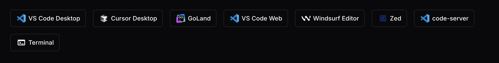

# Coder Registry

[Registry Site](https://registry.coder.com) • [Coder OSS](https://github.com/coder/coder) • [Coder Docs](https://www.coder.com/docs) • [Official Discord](https://discord.gg/coder)

[](https://github.com/coder/registry/actions/workflows/check_registry_site_health.yaml)

Coder Registry is a community-driven platform for extending your Coder workspaces. Publish reusable Terraform as Coder Modules for users all over the world.

> [!NOTE]
> The Coder Registry repo will be updated to support Coder Templates in the coming weeks. You can currently find all official templates in the official coder/coder repo, [under the `examples/templates` directory](https://github.com/coder/coder/tree/main/examples/templates).

## Overview

Coder is built on HashiCorp's open-source Terraform language to provide developers an easy, declarative way to define the infrastructure for their remote development environments. Coder-flavored versions of Terraform allow you to mix in reusable Terraform snippets to add integrations with other popular development tools, such as JetBrains, Cursor, or Visual Studio Code.

Simply add the correct import snippet, along with any data dependencies, and your workspace can start using the new functionality immediately.



More information [about Coder Modules can be found here](https://coder.com/docs/admin/templates/extending-templates/modules), while more information [about Coder Templates can be found here](https://coder.com/docs/admin/templates/creating-templates).

## Getting started

The easiest way to discover new modules and templates is by visiting [the official Coder Registry website](https://registry.coder.com/). The website is a full mirror of the Coder Registry repo, and it is where .tar versions of the various resources can be downloaded from, for use within your Coder deployment.

Note that while Coder has a baseline set of requirements for allowing an external PR to be published, Coder cannot vouch for the validity or functionality of a resource until that resource has been flagged with the `verified` status. [All modules under the Coder namespace](https://github.com/coder/registry/tree/main/registry/coder) are automatically verified.

### Getting started with modules

To get started with a module, navigate to that module's page in either the registry site, or the main repo:

- [The Cursor repo directory](https://github.com/coder/registry/tree/main/registry/coder/modules/cursor)
- [The Cursor module page on the main website](https://registry.coder.com/modules/cursor)

In both cases, the main README contains a Terraform snippet for integrating the module into your workspace. The snippet for Cursor looks like this:

```tf
module "cursor" {
  count    = data.coder_workspace.me.start_count
  source   = "registry.coder.com/modules/cursor/coder"
  version  = "1.0.19"
  agent_id = coder_agent.example.id
}
```

Simply include that snippet inside your Coder template, defining any data dependencies referenced, and the next time you create a new workspace, the functionality will be ready for you to use.

## Contributing

We are always accepting new contributions. [Please see our contributing guide for more information.](./CONTRIBUTING.md)
