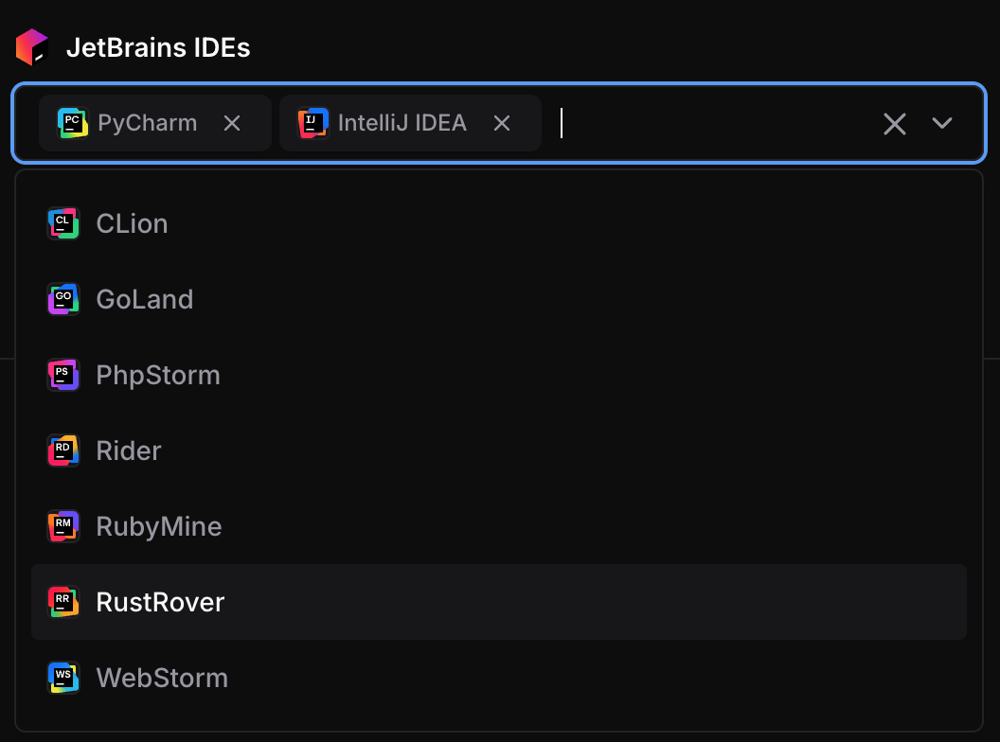

# JetBrains IDEs

This module adds JetBrains IDE buttons to launch IDEs directly from the dashboard by integrating with the JetBrains Toolbox.

```tf
module "jetbrains" {
  count    = data.coder_workspace.me.start_count
  source   = "registry.coder.com/coder/jetbrains/coder"
  version  = "1.0.3"
  agent_id = coder_agent.example.id
  folder   = "/home/coder/project"
}
```



> [!IMPORTANT]
> This module requires Coder version 2.24+ and [JetBrains Toolbox](https://www.jetbrains.com/toolbox-app/) version 2.7 or higher.

> [!WARNING]
> JetBrains recommends a minimum of 4 CPU cores and 8GB of RAM.
> Consult the [JetBrains documentation](https://www.jetbrains.com/help/idea/prerequisites.html#min_requirements) to confirm other system requirements.

## Examples

### Pre-configured Mode (Direct App Creation)

When `default` contains IDE codes, those IDEs are created directly without user selection:

```tf
module "jetbrains" {
  count    = data.coder_workspace.me.start_count
  source   = "registry.coder.com/coder/jetbrains/coder"
  version  = "1.0.3"
  agent_id = coder_agent.example.id
  folder   = "/home/coder/project"
  default  = ["PY", "IU"] # Pre-configure GoLand and IntelliJ IDEA
}
```

### User Choice with Limited Options

```tf
module "jetbrains" {
  count    = data.coder_workspace.me.start_count
  source   = "registry.coder.com/coder/jetbrains/coder"
  version  = "1.0.3"
  agent_id = coder_agent.example.id
  folder   = "/home/coder/project"
  # Show parameter with limited options
  options = ["IU", "PY"] # Only these IDEs are available for selection
}
```

### Early Access Preview (EAP) Versions

```tf
module "jetbrains" {
  count         = data.coder_workspace.me.start_count
  source        = "registry.coder.com/coder/jetbrains/coder"
  version       = "1.0.3"
  agent_id      = coder_agent.example.id
  folder        = "/home/coder/project"
  default       = ["IU", "PY"]
  channel       = "eap"    # Use Early Access Preview versions
  major_version = "2025.2" # Specific major version
}
```

### Custom IDE Configuration

```tf
module "jetbrains" {
  count    = data.coder_workspace.me.start_count
  source   = "registry.coder.com/coder/jetbrains/coder"
  version  = "1.0.3"
  agent_id = coder_agent.example.id
  folder   = "/workspace/project"

  # Custom IDE metadata (display names and icons)
  ide_config = {
    "IU" = {
      name  = "IntelliJ IDEA"
      icon  = "/custom/icons/intellij.svg"
      build = "251.26927.53"
    }
    "PY" = {
      name  = "PyCharm"
      icon  = "/custom/icons/pycharm.svg"
      build = "251.23774.211"
    }
  }
}
```

### Single IDE for Specific Use Case

```tf
module "jetbrains_pycharm" {
  count    = data.coder_workspace.me.start_count
  source   = "registry.coder.com/coder/jetbrains/coder"
  version  = "1.0.3"
  agent_id = coder_agent.example.id
  folder   = "/workspace/project"

  default = ["PY"] # Only PyCharm

  # Specific version for consistency
  major_version = "2025.1"
  channel       = "release"
}
```

## Behavior

### Parameter vs Direct Apps

- **`default = []` (empty)**: Creates a `coder_parameter` allowing users to select IDEs from `options`
- **`default` with values**: Skips parameter and directly creates `coder_app` resources for the specified IDEs

### Version Resolution

- Build numbers are fetched from the JetBrains API for the latest compatible versions when internet access is available
- If the API is unreachable (air-gapped environments), the module automatically falls back to build numbers from `ide_config`
- `major_version` and `channel` control which API endpoint is queried (when API access is available)

## Supported IDEs

All JetBrains IDEs with remote development capabilities:

- [CLion (`CL`)](https://www.jetbrains.com/clion/)
- [GoLand (`GO`)](https://www.jetbrains.com/go/)
- [IntelliJ IDEA Ultimate (`IU`)](https://www.jetbrains.com/idea/)
- [PhpStorm (`PS`)](https://www.jetbrains.com/phpstorm/)
- [PyCharm Professional (`PY`)](https://www.jetbrains.com/pycharm/)
- [Rider (`RD`)](https://www.jetbrains.com/rider/)
- [RubyMine (`RM`)](https://www.jetbrains.com/ruby/)
- [RustRover (`RR`)](https://www.jetbrains.com/rust/)
- [WebStorm (`WS`)](https://www.jetbrains.com/webstorm/)
