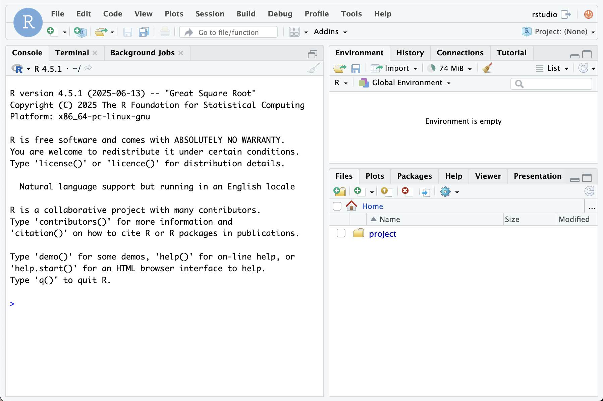

# RStudio Server

> [!NOTE]
> This module requires `docker` to be available in the workspace. Check [Docker in Workspaces](https://coder.com/docs/admin/templates/extending-templates/docker-in-workspaces) to learn how you can set it up.

Deploy the Rocker Project distribution of RStudio Server in your Coder workspace.



```tf
module "rstudio-server" {
  count    = data.coder_workspace.me.start_count
  source   = "registry.coder.com/coder/rstudio-server/coder"
  version  = "0.9.0"
  agent_id = coder_agent.example.id
}
```
