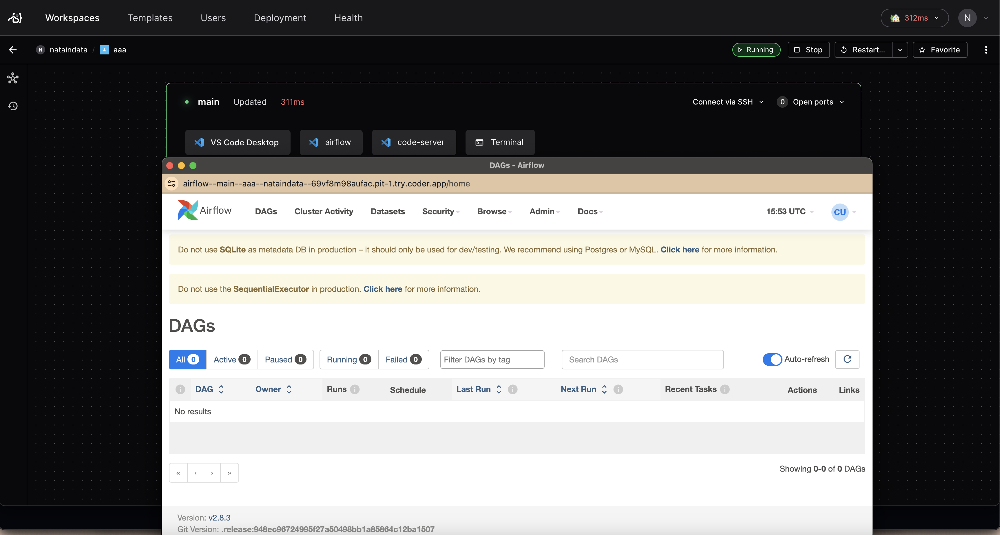

# airflow

A module that adds Apache Airflow in your Coder template.

```tf
module "airflow" {
  count = data.coder_workspace.me.start_count
  # Switch to "registry.coder.com/nataindata/apache-airflow/coder" on the next
  # release
  source   = "registry.coder.com/coder/apache-airflow/coder"
  version  = "1.0.13"
  agent_id = coder_agent.main.id
}
```


